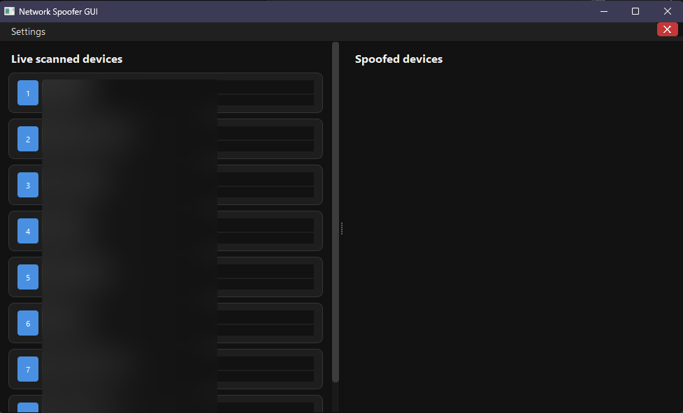

# Network Spoofer — Kick Devices Out with Style 💥

> A Windows-compatible, GUI-powered alternative to the classic [KickThemOut](https://github.com/k4m4/kickthemout)  
> Includes both a **versatile PyQt5 GUI** and a **simple console interface** for ARP spoof-based network control.

---

## 🧠 What is this?

This project is a modern reimplementation of the well-known `kickthemout` script, originally made for Linux systems.

I wanted something similar I could run **natively on Windows**, with a clean, responsive UI and the same ability to **"kick devices off" your local network** using ARP spoofing.

---

## ✨ Features

- ⚡ Live network scanner (built with `scapy`)
- 🖥️ Sleek PyQt5 GUI with drag-and-drop device spoofing
- 💻 Console-based version for minimalists
- 🧹 Automatically stops spoofing threads on exit
- 🧠 Customizable and extendable — easy to tweak or expand

---

## 🖼 GUI Preview

> _Drag & drop devices between columns to start/stop spoofing them_  
> _Live scanning keeps device info up-to-date in real-time._

<!-- IMAGE PLACEHOLDER BELOW -->
<p align="center">
  
</p>
<p align="center">
  
</p>
---

## 🚀 How it Works

- The tool scans your local subnet (e.g., `192.168.1.0/24`) using ARP broadcast requests
- It builds a list of all active devices and their MAC/IPs
- When spoofing is enabled, it **sends forged ARP replies** to a device, telling it that the router is your machine
- This disrupts the target’s connection by poisoning its ARP cache, effectively “kicking” it offline

---

## 🛠 Requirements

- Python 3.7+
- [Scapy](https://pypi.org/project/scapy/)
- [PyQt5](https://pypi.org/project/PyQt5/)

```bash
pip install scapy PyQt5
